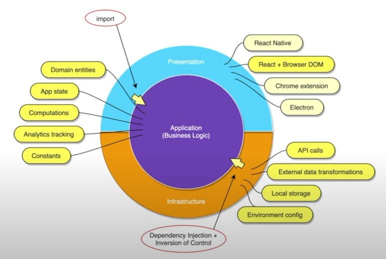
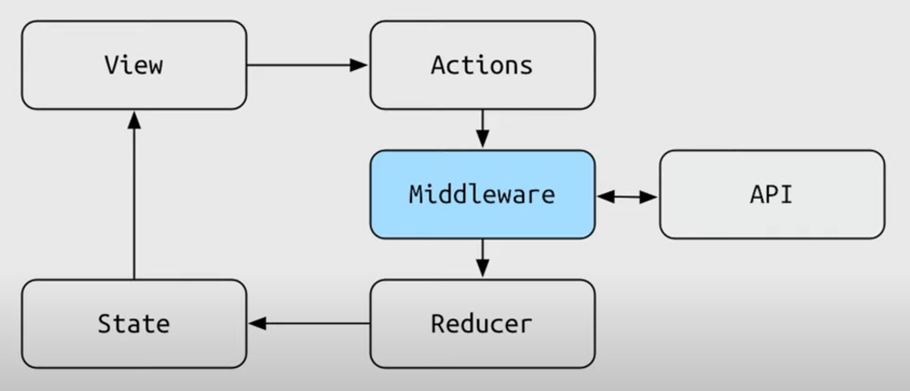

# Clean Architecture in React

## Clean Architecture

- Core independent of Presentation
- Core independent of Infrastructure
- Business logic first
- Easily tastable
- Cross-platform


## Clean Front-End Architecture



## Essential Todos

A demo project for the YouTube video: Clean Architecture in React.

## Built with Clean Architecture

- Application - Redux
- Views - React
- Infrastructure - Axios

## Other Features

- All business logic resides in Redux Middleware
- Fetches dummy todo data from <https://jsonplaceholder.typicode.com>
- Boostraped with `create-react-app`

## Project structure

- TodoApp
  - public
    - src
      - application
        - actions
          - todos.js
          - ui.js
        - middleware
          - index.js
          - todos.js
          - todos.test.js
          - ui.js
          - ui.test.js
        - reducers
          - index.js
          - todos.js
        - selectors
          - todos.js
          - ui.js
        - store.js
      - infrastructure/service
        - api
        - logger
        - index.js
      - views
        - index.js
      - index.js

> index.js

```js
import React from "react";
import ReactDom from "react-dom";
import { Provider } from "react-redux";
import { configureStore } from "./application/store";
import services from "./infrastructure/services";
import App from "./views/App";

ReactDOM.render(
  <Provider store={configureStore(services)}>
    <App />
  </Provider>,
  document.getElementById("root")
);
```

### Aplication Actions

> aplication/actions/todos.js

```js
export const LOAD_TODOS = "[todos] load";
export const LOAD_TODOS_SUCCESS = "[todos] load success";
export const LOAD_TODOS_FAILURE = "[todos] load failure";
export const SET_TODOS = "[todos] set";
export const PUT_TODO = "[todos] put";

export const loadTodos = {
  type: LOAD_TODOS,
};

export const loadTodosSuccess = (todos) => ({
  type: LOAD_TODOS_SUCCESS,
  payload: todos,
});

export const loadTodosFailure = (error) => ({
  type: LOAD_TODOS_FAILURE,
  payload: error,
});

export const setTodos = (todos) => ({
  type: SET_TODOS,
  payload: todos,
});
export const putTodo = (todo) => ({
  type: PUT_TODO,
  payload: todo,
});
```

> aplication/actions/ui.js

```js
export const PAGE_LOADED = "[ui] page loaded";
export const SET_LOADING_ON = "[ui] set loading on";
export const SET_LOADING_OFF = "[ui] set loading off";

export const pageLoaded = {
  type: PAGE_LOADED,
};

export const setLoading = (isLoading) => ({
  type: isLoading ? SET_LOADING_ON : SET_LOADING_OFF,
  payload: isLoading,
});
```

> application/store.js

```js
import { compose, applyMiddleware, createStore } from "redux";
import reducers from "./reducers";
import middleware from "./middleware";

// dev tool
const composeEnhancers =
  (process.env.NODE_DEV === "development" &&
    window.__REDUX_DEVTOOLS_EXTENSION_COMPOSE__) ||
  compose;

export const configureStore = (services) =>
  createStore(
    reducers,
    composeEnhancers(applyMiddleware(...middleware.map((f) => f(services))))
  );
```

### Middleware



> application/middleware/index.js

```js
import ui from "./middleware/ui";
import todos from "./middleware/todos";

export default [...ui, ...todos];
```

> application/middleware/ui.js

```js
import { PAGE_LOADED } from "./actions/ui";
import * as todosAction from "./actions/todos";

const pageLoadedFlow =
  ({ log }) =>
  ({ dispatch }) =>
  (next) =>
  (action) => {
    next(action);

    if (action.type == PAGE_LOADED) {
      log("page loaded");
      dispatch(todosAction.loadTodos);
    }
  };

export default [pageLoadedFlow];
```

> application/middleware/ui.test.js

```js
import { PAGE_LOADED } from "./actions/ui";
import uiMiddleware from "./middleware/ui";

describe("ui middleware", () => {
  describe("page loaded flow", () => {
    const { pageLoadedFlow } = uiMiddleware;

    const log = jest.fn();
    const dispatch = jest.fn();
    const next = jest.fn();
    const action = {
      type: PAGE_LOADED,
    };

    it("passes action to next middleware", () => {
      pageLoadedFlow({ log })({ dispatch })(next)(action);

      expect(next).toHaveBeenCalledWith(action);
    });

    it("calls log with correct argument", () => {
      pageLoadedFlow({ log })({ dispatch })(next)(action);

      expect(log).toHaveBeenCalledWith("page loaded");
    });
  });
});
```

> application/middleware/todos.js

```js
import {
  loadTodosFailure,
  loadTodosSuccess,
  LOAD_TODOS,
  PUT_TODO,
  setTodos,
} from "./actions/todos";
import * as uiActions from "./actions/ui";

const loadTodosFlow =
  ({ api }) =>
  ({ dispatch }) =>
  (next) =>
  async (action) => {
    next(action);

    if (action.type == LOAD_TODOS) {
      try {
        dispatch(uiActions.setLoading(true));
        const todos = await api.todos.getAll();
        dispatch(loadTodosSuccess(todos));
        dispatch(uiActions.setLoading(false));
      } catch (error) {
        dispatch(loadTodosFailure(error));
      }
    }
  };

const putTodosFlow =
  () =>
  ({ dispatch, getState }) =>
  (next) =>
  (action) => {
    if (action.type == PUT_TODO) {
      const oldTodosClone = getState().todos.allTodos.map((todo) => ({
        ...todo,
      }));

      const newTodo = action.payload;

      const index = oldTodosClone.findIndex((todo) => todo.id === newTodo.id);

      oldTodosClone[index] = newTodo;

      dispatch(setTodos(oldTodosClone));
    }

    next(action);
  };

export default [loadTodosFlow, putTodosFlow];
```

> application/middleware/todos.test.js

```js
import { loadTodosSuccess, LOAD_TODOS } from "../actions/todos";
import todosMiddleware from "./todos";

describe("todos middleware", () => {
  describe("load todos flow", () => {
    const [loadTodosFlow] = todosMiddleware;

    const dummyTodo = {
      id: "1",
      title: "Dummy todo",
      completed: true,
    };
    const api = {
      todos: {
        getAll: jest
          .fn()
          .mockImplementationOnce(
            () => new Promise((resolve) => resolve([dummyTodo]))
          ),
      },
    };
    const dispatch = jest.fn();
    const next = jest.fn();
    const action = {
      type: LOAD_TODOS,
    };

    it("passes action to next middleware", async () => {
      await loadTodosFlow({ api })({ dispatch })(next)(action);

      expect(next).toHaveBeenCalledWith(action);
    });

    it("calls api.todos.getAll at least once", async () => {
      await loadTodosFlow({ api })({ dispatch })(next)(action);

      expect(api.todos.getAll).toHaveBeenCalled();
    });

    it("calls api.todos.getAll at least once", async () => {
      await loadTodosFlow({ api })({ dispatch })(next)(action);

      expect(dispatch).toHaveBeenCalledWith(loadTodosSuccess([dummyTodo]));
    });
  });
});
```

### Infrastructure

> infrastructure/index.js

```js
import consoleLogger from "./services/logger/console";
import elasticSearchLogger from "./services/logger/elastic-search";
import api from "./services/api";

const env = "production"; /* process.NODE_ENV  */

const services = {
  log: env === "development" ? consoleLogger : elasticSearchLogger,
  api,
};

export default services;
```

> infrastructure/api/index.js

```js
import todos from "./api/todos";

export default {
  todos,
};
```

> infrastructure/api/todos/index.js

```js
import axios from "axios";

export default {
  getAll: async () => {
    const response = await axios.get(
      "https://jsonplaceholder.typecode.com/todos"
    );

    return response.data;
  },
};
```

> infrastructure/logger/console.js

```js
const log = console.log;

export default log;
```

> infrastructure/logger/elastic-search.js

```js
const log = (message) => {
  console.log("Send to Elastic Search: ", message);
};

export default log;
```

### Reducers

> application/reducers/index.js

```js
import { combineReducers } from "redux";
import ui from "./reducers/ui";
import todos from "./reducers/todos";

export default combineReducers({
  ui,
  todos,
});
```

> application/reducers/todos.js

```js
import { LOAD_TODOS_SUCCESS, SET_TODOS } from "../actions/todos";

const initialState = {
  allTodos: [],
  error: null,
};

const reducer = (state = initialState, action) => {
  switch (action.type) {
    case LOAD_TODOS_SUCCESS:
      return { allTodos: action.payload, error: null };
    case SET_TODOS:
      return { allTodos: action.payload, error: null };
    default:
      return state;
  }
};

export default reducer;
```

> application/reducers/ui.js

```js
import * as uiActions from "../actions/ui";

const initialState = {
  loading: true,
};

export default (state = initialState, action) => {
  switch (action.type) {
    case uiActions.SET_LOADING_ON:
    case uiActions.SET_LOADING_OFF:
      return { ...state, loading: action.payload };
    default:
      return state;
  }
};
```

### Selectors

> application/selectors/ui.js

```js
export const getLoading = (state) => state.ui.loading;
```

> application/selectors/todos.js

```js
export const getTodos = (state) => state.todos.allTodos;
```

### Views

> views/index.js

```js
import React, { useEffect } from "react";
import { useDispatch, useSelector } from "react-redux";
import { getTodos } from "../application/selectors/todos";
import { getLoading } from "../application/selectors/ui";
import { pageLoaded } from "../application/actions/ui";
import { putTodo } from "../application/actions/todos";

export default () => {
  const dispatch = useDispatch();
  const todos = useSelector(getTodos);
  const loading = useSelector(getLoading);

  useEffect(() => {
    dispatch(pageLoadded);
  }, [dispatch]);

  return (
    <>
      <h1>Essential Todos</h1>
      {loading ? (
        "Loading todos..."
      ) : (
        <ul>
          {todos.map((todo) => (
            <li
              key={todo.id}
              style={{
                textDecoration: todo.completed ? "line-through" : "none",
                cursor: "pointer",
              }}
              onClick={() =>
                dispatch(putTodo({ ...todo, completed: !todo.completed }))
              }
            >
              {todo.title}
            </li>
          ))}
        </ul>
      )}
    </>
  );
};
```
